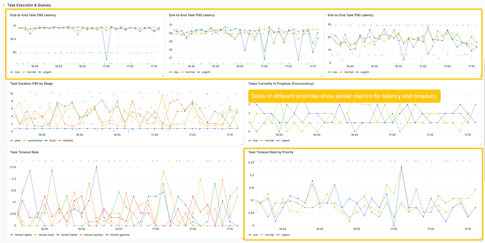
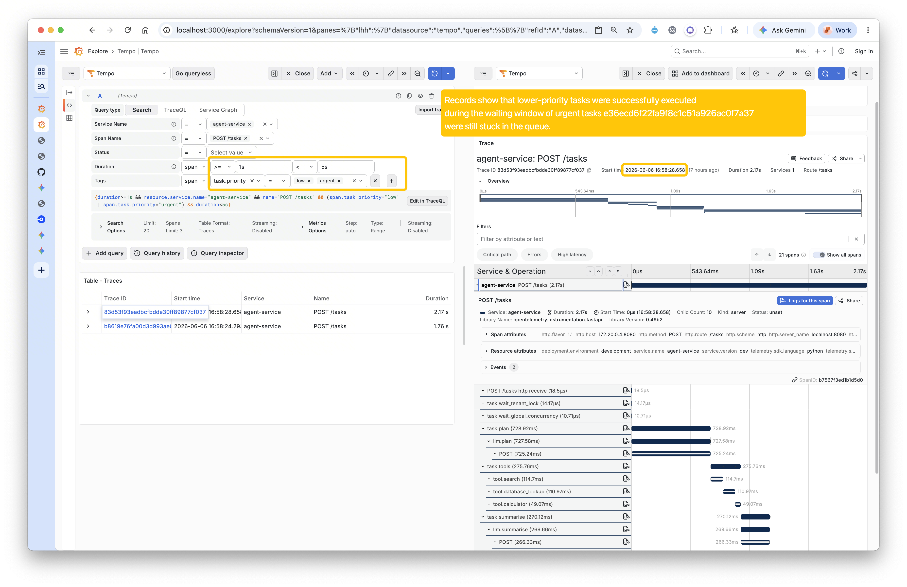
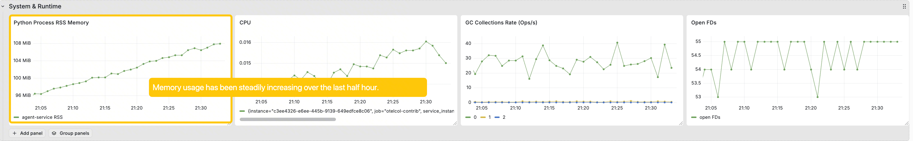
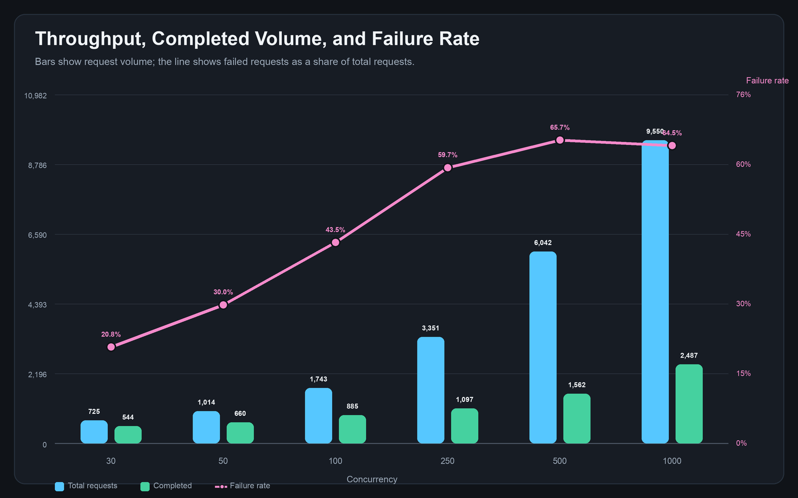
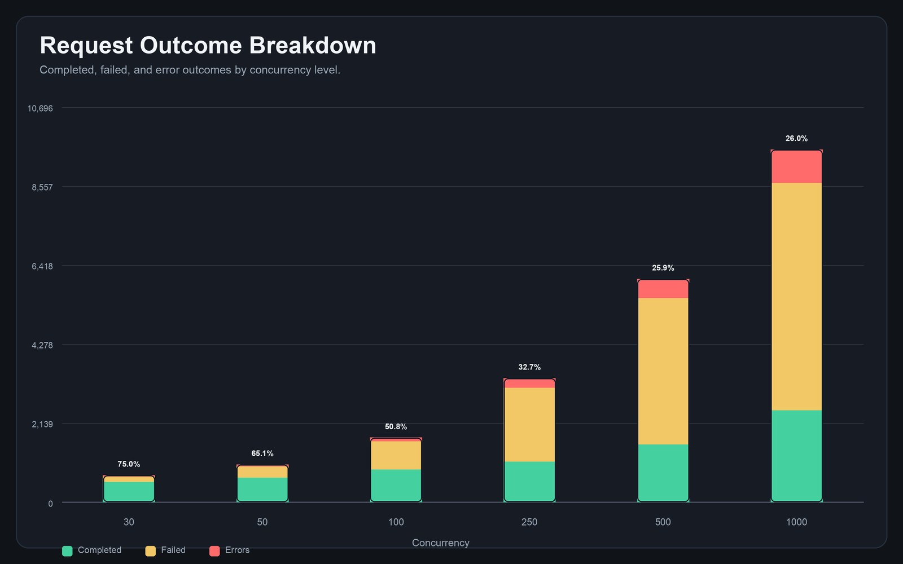
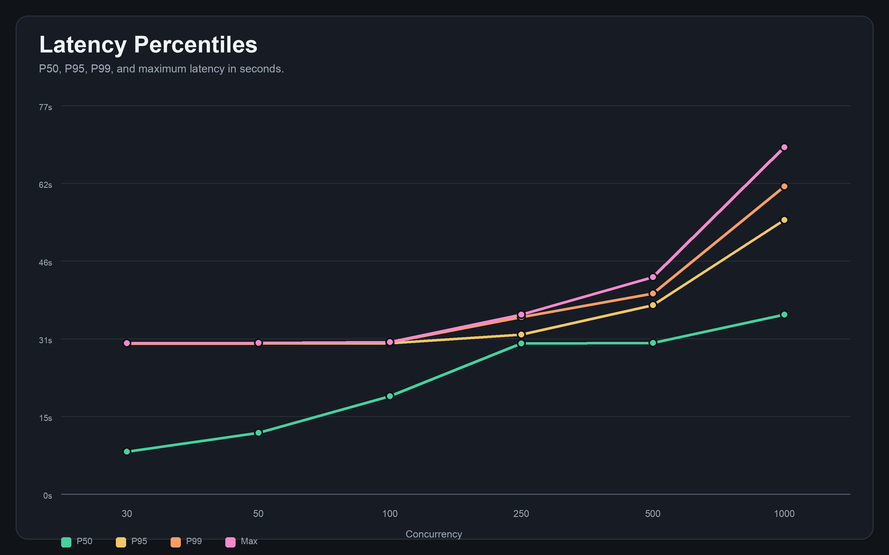
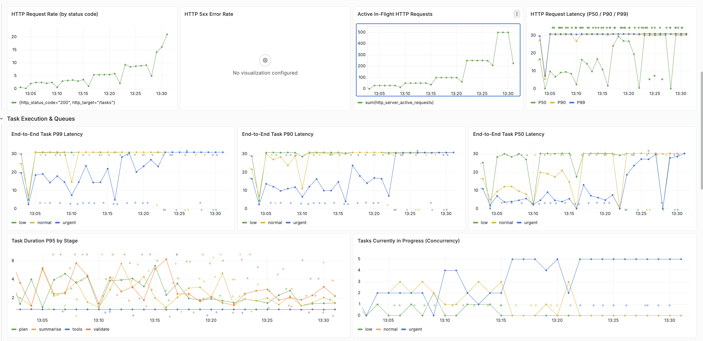
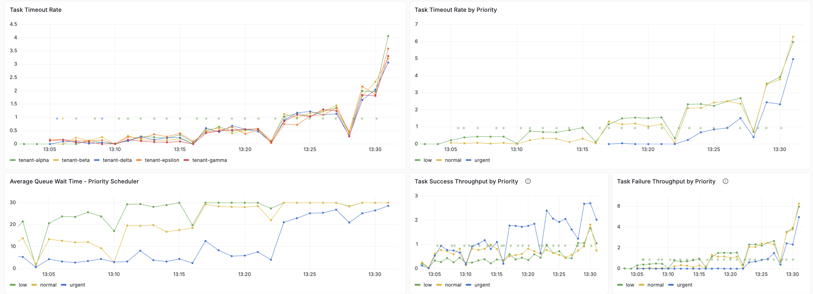
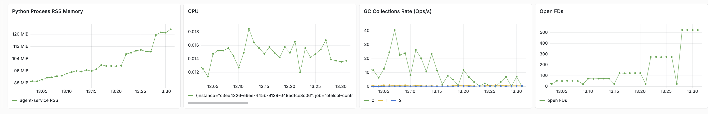
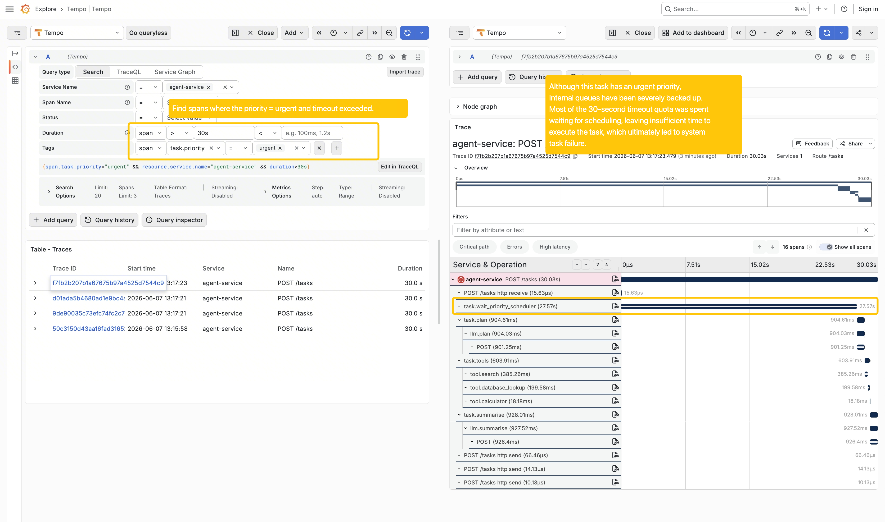

# Issue 1. The exposed `priority` field is not working [FIXED]

## 1. Description
The API accepts `urgent`, `normal`, and `low`, but `priority` is not used to influence scheduling, timeout policy, retry policy, queue order, or cache segmentation.

## 2. Evidence

### 2.1 Code
The `run_task` function in `orchestrator.py` file and `create_task` function in `main.py ` doesn't use `priority` variables for queue scheduling.

### 2.2 Metrics
Running load test: with argument: 5 tenants, 30 concurrency, 1000 total requests and observe the system 30 minutes

In the `Task Execution & Queues` Section of the metrics dashboard, we can find some evidences that `priority` field is not working

- tasks of different priority have about the same latency
- tasks of different priority have about the same task Timeout Rate 


The system bottleneck is the backend LLM rate limiting. In this scenario, it is restricted to a maximum of 5 requests(MAX_CONCURRENT_TASKS=5) Both evidences indicate that when the backend IM rate limiting is reached, we are not prioritizing their scheduling based on task priority.  Instead, we are scheduling them in an egalitarian manner, which has resulted in a uniform failure rate across the board.

### 2.3 Trace & Log


Noticed that an urgent task occurring at this point: 2026-06-06 16:58:24.016 It then entered a wait period and eventually timed out.
However, by searching the traces, we discovered that some lower-priority task was executed while the urgent task was still in the waiting phase.




## 3. Root Cause Analysis

Although the API accepts the priority field, scheduling mechanisms like locks, semaphores, rate limiters, and caches treat all tasks identically using standard FIFO ordering. The `priority` field is not really used for queue scheduling.

## 4. Discovery Path
- Codex: Code Investigation
    > Prompt: "The service is functional but has **several hidden issues** affecting reliability, performance, and cost efficiency. Find them"
- Codex: Observability Dashboard Investigation(using grafana MCP)
    > Prompt: "Explore the project observability dashboard/logs/traces to find any anomalies or patterns"
- Human Confirmation

## 5. Fix Proposition
* Priority-Aware Queuing Across All Bottlenecks
Upgrade all task execution queues or locks in the pipeline to use priority-aware data structures (like `heapq`). This ensures that urgent tasks consistently bypass normal or low tasks at every waiting stage.

* Differentiated Timeouts and Retries
Map the `Priority` enum to specific execution configurations. For example, assign aggressive retries (e.g., 5 attempts) and robust timeouts to urgent tasks, while giving low priority tasks fewer retries to conserve LLM API costs.


Note that the current fix is still quite simple. In a production environment, we may need to consider a few additional issues:

1. Distributed deployment: If all requests are distributed evenly across services, we can stick with the current design. However, if different instances carry different priorities, we might need to introduce a global, independent queue for task distribution instead of the current memory-based approach.

2. We still lack an overload protection mechanism. Currently, all tasks are added to our message queue indiscriminately, even when the system is already under heavy load.  This will be discussed in detail in the later sections of this document.

## 6. Before-After Comparision
See [FIX.md](FIX.md)

---
# Issue 2. Unbounded in-memory state causes eventual OOM, Data loss occurred because the state was not persisted. [FIXED]
## 1. Description
The service stores task results and execution audit records in module-level memory with no cleanup policy. This means long-running processes accumulate data forever.

- `task_store` never evicts completed or failed tasks.
- `_response_cache` is a dict that never expiresicts any entries.
- `_execution_log` stores prompts, responses, tool outputs, and timestamps for every successful task with no cap.

Additionally, this critical data isn't being saved to a database or object storage, which means it gets lost whenever a container restarts.
Furthermore, because we don't have centralized storage yet, task queries cannot be shared across different instances. **This essentially prevents the system from being deployed in a distributed manner.**

## 2. Evidence


## 3. Root Cause Analysis
The service keeps task results and audit records in module-level memory without TTL, size limits, or cleanup. Over time, task_store and _execution_log grow with traffic, causing unbounded memory usage.

## 4. Discovery Path
- Codex: Code Investigation
    > Prompt: "The service is functional but has **several hidden issues** affecting reliability, performance, and cost efficiency. Find them"
- Codex: Observability Dashboard Investigation(using grafana MCP)
    > Prompt: "Explore the project observability dashboard/metrics/logs/traces to find any anomalies or patterns"
- Human Confirmation

## 5. Fix Proposition
  Modify `_response_cache` into a LRU+TTL cache to limit the memory usage.
  Introduce a `sink` abstraction for `task_store` and `_execution_log` audit records. The service will publish records to bounded no-op sinks for now, while keeping the design ready for future Kafka, database, or observability pipeline exports.

  Note that the above fix proposition is **still quite naive** For a production environment, we’ll likely need to do some more additional design and implementation.
    1. In production, we likely want multiple agent service instances to share the same storage. To achieve this, we might replace the current in-memory cache with an independent KV store, such as Redis or a similar solution. Implementing a distributed cache this way would help achieve a higher cache hit rate.
    2. We may also want to use RDS/MongoDB/Other Database to replace the current TaskStore and utilize Kafka/RabbitMQ/Other Message Queue to export these logs to a reliable storage system for subsequent auditing and statistical analysis.

## 6. Before-After Comparision
See [FIX.md](FIX.md)

---
# Issue 3. Lacks a rate-limiting protection mechanism. 
## 1. Description
The service currently accepts all incoming tasks indiscriminately and adds them to an memory queue, even when the system is operating at maximum capacity. In other words, the system accepts certain tasks that are almost guaranteed to time out. This will result in wasted resources, stability issues, and a poor experience for upstream callers. If the upstream strategy is configured with retry logic, it could potentially worsen the backlog. A **fail-fast strategy** is better choice.

## 2. Evidence
For requests that clearly exceed the system's capacity, most end up in a timeout state, which leads to a certain amount of resource waste, Moreover, it forces the client to maintain a connection that is destined to fail for an extended period, which leads to a poor user experience and poor system stability.
While the system is still able to normally process requests within its designated range, tasks continue to pile up in memory. Despite this, the overall failure rate remains at a very low level.

### 2.1 Code 
By exploring the code with the Agent, we can see that the current queue is an unbounded, memory-based structure. Consequently, we don't reject any requests based on capacity. We can therefore infer that the system won't deny any incoming requests due to current capacity limits; instead, these requests will simply time out naturally.

### 2.2 Load Test 
Enhance our stress testing script to track the success and failure rates across different levels of concurrency. Each test runs for 5 minutes. 
```sh
    for c in 30 50 100 250 500 1000; do
        python -m tests.test_load --minutes 10 --tenant 5 --concurrency "$c" --output "report/${c}.json"
        sleep 300
    done
```

### 2.2.1 Load Test Report
Based on the stress test report, it is clear that as the volume of requests increases, we are exceeding the system's load capacity. Most of these requests are bound to time out. 
In this situation, our system should proactively and selectively disconnect incoming requests to avoid wasting resources on unnecessary waiting and connections. Furthermore, this mechanism will allow us to implement fallback strategies later on.

>  Ideally, we should prefer use existing open-source load testing tools like [k6](https://k6.io/) rather than our own custom Python scripts. The load testing scripts and the service under test should be deployed on separate machines to avoid any potential interference.




System throughput initially increases along with the concurrency. However, the failure rate also continues to rise during this time. It's because our backend LLM is our main bottleneck. 

When system capacity is exceeded, requests stack up in the memory queue and inevitably time out, forcing clients to hold connections unnecessarily. Consequently, the backend LLM wastes valuable computing resources processing these already-expired tasks instead of handling viable new ones.

Implementing a fail-fast admission control layer (returning 429) would protect system stability and ensure that available capacity is dedicated to requests that can successfully complete.

### 2.2.2 Metrics




### 2.2.3 Traces


## 3. Root Cause Analysis
The scheduling mechanism does not enforce a maximum queue depth or dynamically evaluate the expected wait time. Consequently, during traffic spikes, the system continues to accept requests that mathematically cannot be completed within the TASK_TIMEOUT_SECONDS limit, resulting in severe resource contention, and a high timeout failure rate.

## 4. Discovery Path
Run extended stress tests that significantly exceed the system's current load capacity. Before running the test, we first need to refactor our script to support a high enough level of concurrency. Otherwise, limitations within the system or networking libraries will prevent it from generating sufficient load for the stress test.
```python
python -m tests.test_load --requests 2000 --tenant 5 --concurrency 1000
```
Then combine with various agent-based research methods mentioned above to pinpoint the root cause. We also collect data by conducting pressure tests at a finer granularity.

## 5. Fix Proposition
**Summary**

 Introduce an admission control layer before tasks enter the in-memory priority scheduler. The
  service should no longer accept every cache-miss request blindly. Instead, it should estimate

**Core Approach**

 The key idea is capacity-based rejection.

  Before accepting a new task, the service estimates current available capacity using feedback
  from the running system: 

  - current number of running tasks
  - current queue length
  - recent task execution latency
  - configured concurrency limit
  - request priority

  Based on these signals, the service estimates the expected queueing delay for the new
  request. If the estimated delay is already too high, the request should not be admitted.

**Implementation Direction**

  Add admission control after cache lookup and before creating a pending task.
  Expected behavior:
  - Cache hits are still returned immediately.
  - Cache misses go through capacity evaluation.
  - Requests within capacity enter _PriorityTaskScheduler.
  - Requests beyond capacity return 429.
  - Rejected requests are not written as pending tasks.
  - Rejected requests are not counted as admitted task failures.

  The capacity model should be dynamic rather than purely static. A simple feedback-control
  model is enough for v1: use recent task latency and current backlog to estimate whether
  accepting more work would likely cause timeout or severe queueing.

## 6. Before-After Comparision
Due to time constraints, this issue has not been fixed.
