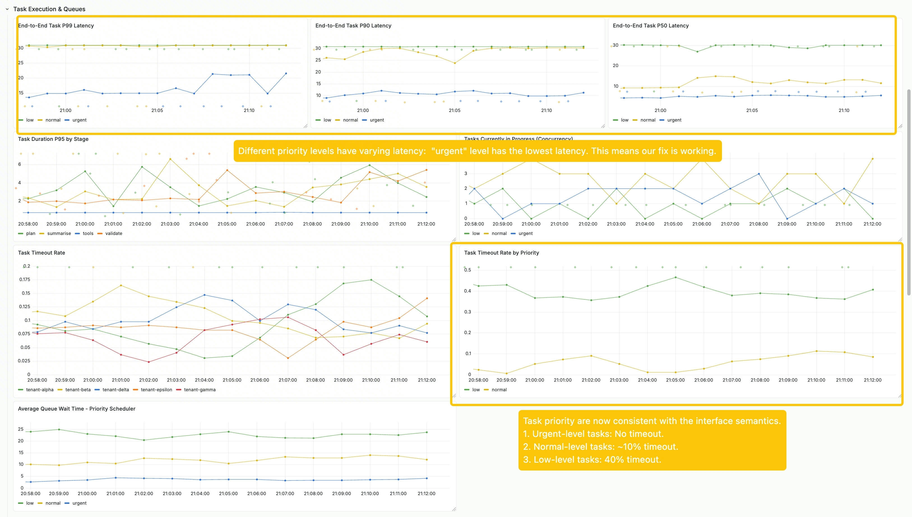
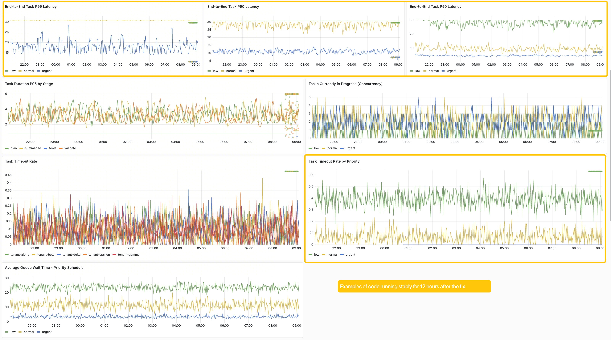
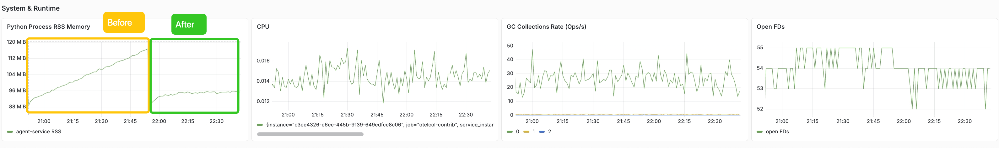
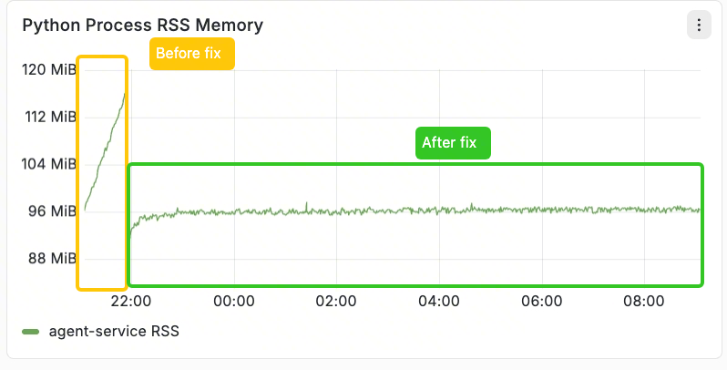

# FIX 1. The exposed `priority` field is not working 
## 1. Before-After Comparision
### Before

### After

As the screenshot can show, after implementing the fix, tasks with different priorities are now scheduled differently. High-priority tasks use preemptive scheduling, which allows them to complete more quickly. This results in lower end-to-end interface latency and a reduced timeout rate.

# FIX 2. Unbounded in-memory state causes eventual OOM
## 1. Before-After Comparision
### Before

### After

As shown in the image, the eventual OOM issue has been resolved in the new version.
