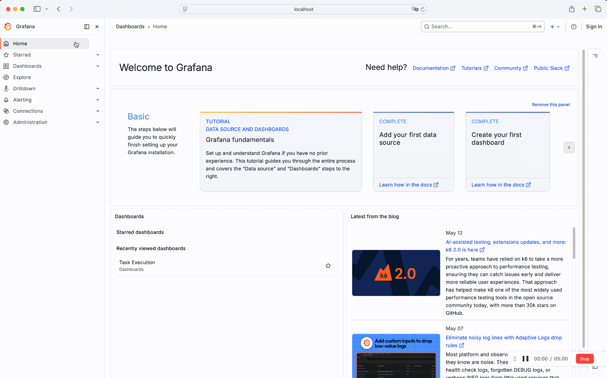
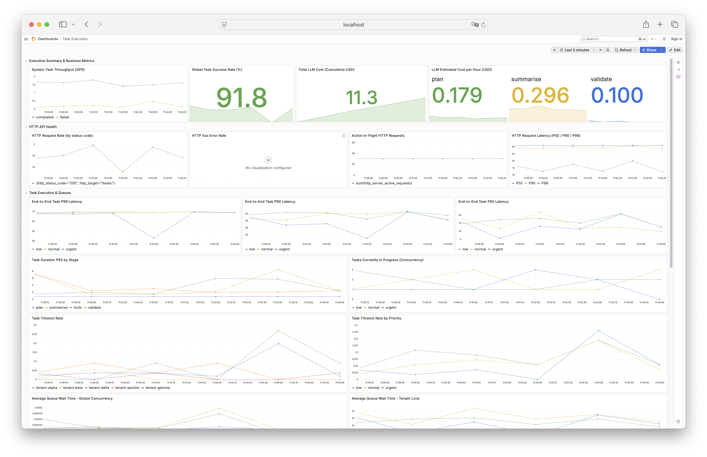
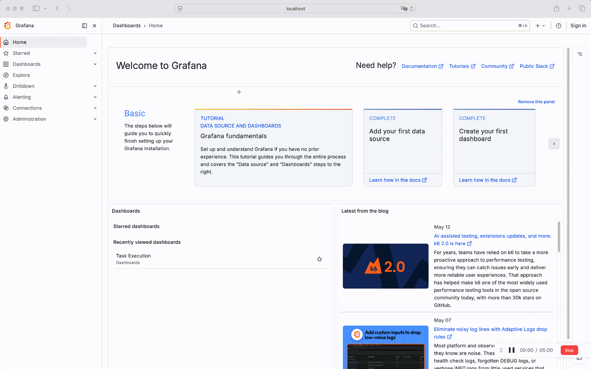
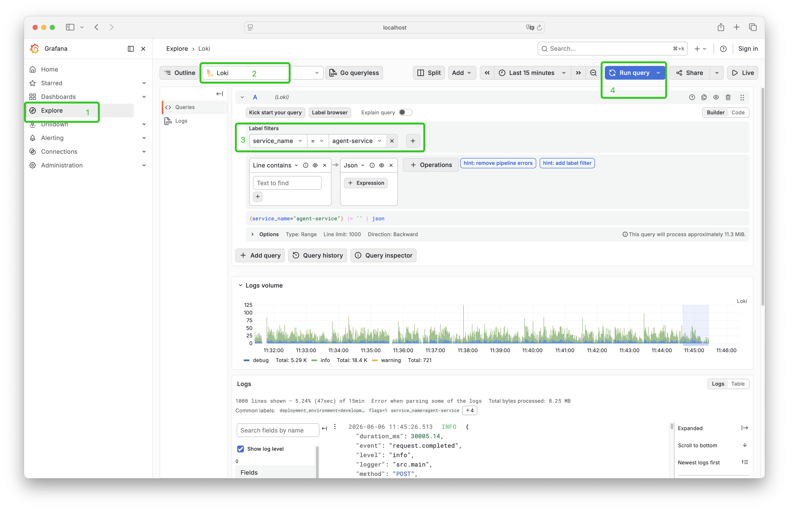
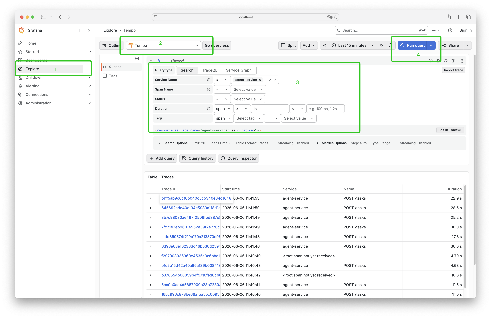
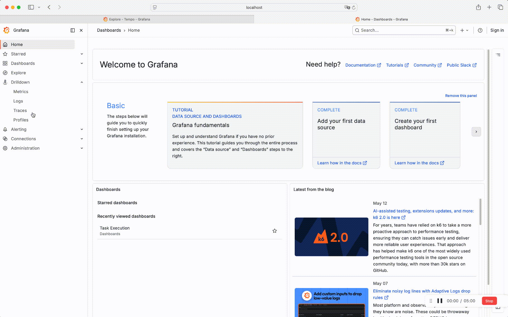
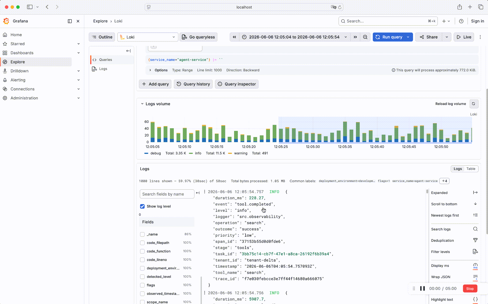
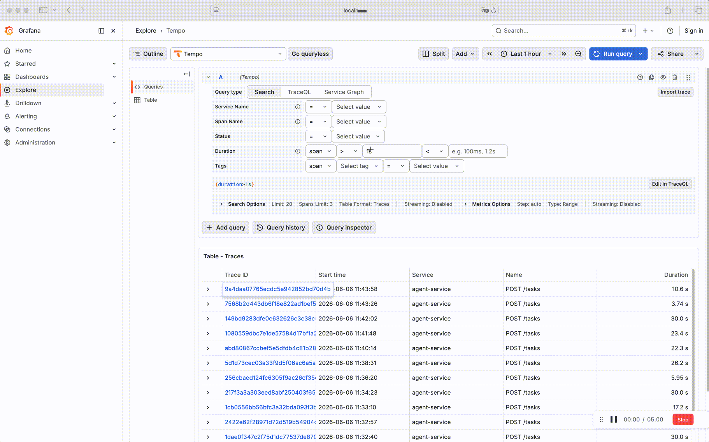
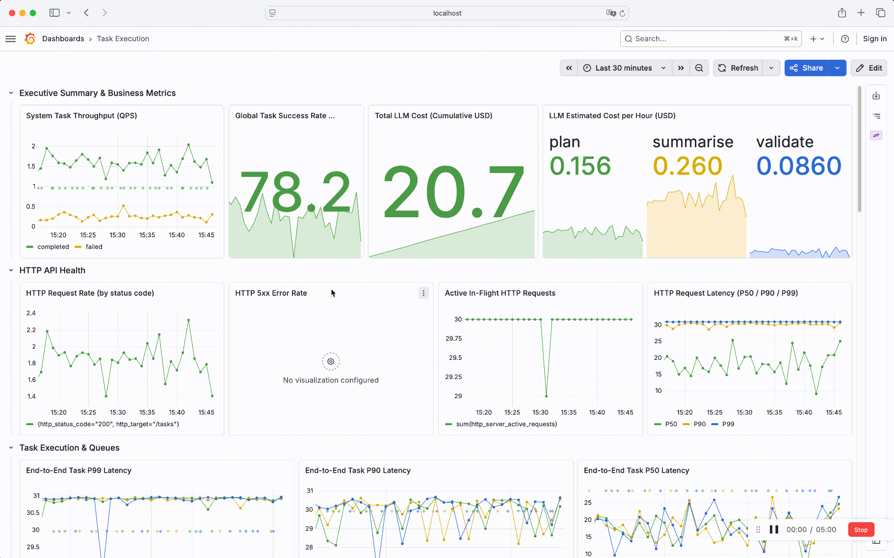

# 0. Project Overview
## Instrumented Source Code 
1. Modified version of code can be found at https://github.com/MUCZ/jpai

* I've made this repository public so the deliverables and diff page are visible to you. **Please tell me if I need to delete it at any time.**

2. See the diff here https://github.com/MUCZ/jpai/pull/1/changes

## Key Deliverables 

1. [Diagnosis Report](DIAGNOSIS.md)

2. [Fix Report](FIX.md)

3. Infrastructure Files: [Docker Compose](./agent-platform/docker-compose.yml) | [Other Config](./agent-platform/conf)

4. [Production Deployment Instructions](DEPLOYMENT.md)

5. [README.md with AI Tool Usage description (this file)](README.md)

# 1. How to run the instrumented system

## Local Setup
Use Docker for the standard local setup:

```bash
docker compose up --build
```

This starts the following services:

- **API**: `http://localhost:8080` (FastAPI Agent Execution Service)
- **Mock LLM**: `http://localhost:8081` (Mock LLM service providing `/v1/inference`)
- **Grafana (OTel LGTM)**: `http://localhost:3000` (Bundled Prometheus, Tempo, and Loki dashboard backend, default theme light)


## Production Setup
See Production_Deployment.md


# 2. How to reproduce the load test

```bash
python -m tests.test_load --tenants 3 --requests 100 --concurrency 30
```

# 3. How to view traces/metrics/logs

## Metrics
1. Open Grafana at `http://localhost:3000/dashboards`. if dashboard is not visible, please choose `Dashboards` from left sidebar menu
2. Open `Task Execution` dashboard, or you can access it directly at `http://localhost:3000/d/gzg2sp/task-execution`


3. Another way to view all the metrics `http://localhost:3000/a/grafana-metricsdrilldown-app/drilldown`


## Logs
1. Open Grafana at `http://localhost:3000/explore`. if Explore page is not visible, please choose `Explore` from left sidebar menu
2. Select `Loki` in the left-top Select dropdown
3. Set Label filter to `service_name="agent-service"`
4. Click the blue `Run query` button   
5. For complex query, use LogQL [Language](https://grafana.com/docs/loki/latest/query/)




6. Another way to view all the logs `http://localhost:3000/a/grafana-lokiexplore-app/explore`


## Traces
1. Open Grafana at `http://localhost:3000/explore`. if Explore page is not visible, please choose `Explore` from left sidebar menu
2. Select `Tempo` in the left-top Select Dropdown
3. Select Search and set Service Name to "agent-service"`
4. Click the blue `Run query` button   
5. For complex query, use TraceQL [Language](https://grafana.com/docs/tempo/latest/traceql/)


6. Another way to view all the traces `http://localhost:3000/a/grafana-exploretraces-app/explore`



## Observability Correlation
### Query traces from log

### Query logs from trace

### Query traces from metrics



# 4. Brief explanation of your observability design choices

## Observability Stack
Ignoring performance profiling, here are our observability stack decisions:

| Dimension | 1. SDK (Application Instrumentation) | 2. Collector (Collection & Export) | 3. Storage (Backend Persistence) |
| :--- | :--- | :--- | :--- |
| **Logs** | **Structlog** + **OpenTelemetry SDK**<br>*(Structlog handles structured logging, bridged to OTel SDK)* | **OpenTelemetry Collector**<br>*(Pushed proactively via OTLP/gRPC)* | **Loki**<br>*(Provided by the `otel-lgtm` backend container)* |
| **Tracing** | **OpenTelemetry SDK**<br>*(Includes auto-instrumentation for FastAPI/HTTPX)* | **OpenTelemetry Collector**<br>*(Pushed proactively via OTLP/gRPC)* | **Tempo**<br>*(Provided by the `otel-lgtm` backend container)* |
| **Metrics** | **OpenTelemetry SDK** | **OpenTelemetry Collector** (Push)<br> & **Prometheus Server** (Pull)<br>*(Supports both OTLP/gRPC Push and `/metrics` Pull)<br>(Prometheus compatibility achieved via the OpenTelemetry Prometheus Exporter.)* | **Prometheus**<br>*(Provided by the `otel-lgtm` backend container)* |

## Decision Rationale
The modern observability stack built around OTLP (OpenTelemetry Protocol) has established itself as the most seamless and standardized open-source observability framework available today. It offers a good user experience, along with strong scalability and maintainability. Consequently, it is our default choice.

In contrast, legacy stacks present several distinct challenges:
- Data Silos: Traditional tools operate independently, making it highly inefficient to correlate logs, metrics, and traces.
- Operational Friction: Legacy systems frequently suffer from issues regarding cost, operational complexity, and usability.

Though we cannot claim that the OTLP ecosystem outperforms traditional, specialized tools (such as Filebeat + Elasticsearch + Kibana for logging, Jaeger for tracing) in absolutely every single niche scenario. For a greenfield project completely free of technical debt, the OTLP-driven stack is undeniably the optimal choice.

## Alternatives Comparison
###  Logging 
1. `logging` (The Traditional Base)
* Pros:
    * Maturity: Classic, highly reliable, and universally supported across all Python libraries.
* Cons:
    * Complex Configuration: Verbose boilerplate setup; requires third-party packages (like `python-json-logger`) for structured JSON logging.
    * Lack of capabilities: we need to reinvent the wheel to implement certain exclusive features.

2. `Loguru` (The Dev-Friendly Alternative)

* Pros:
    * Developer Experience: Simple out-of-the-box setup with beautiful terminal formatting and rich traceback logging.
* Cons:
    * **Ecosystem Isolation**: Integrating with OpenTelemetry (OTel) is a major pain, making it difficult to gracefully and seamlessly inject microservice Trace IDs into logs automatically.

3. `structlog` (The Modern OTLP Choice)
* Pros:
    * Native Structure: Data-first design that outputs clean JSON natively, making it perfectly optimized for machine readability and backends like Loki/Elasticsearch.
    * Powerful Context Binding: Uses `contextvars` to effortlessly pass and bind request-specific data down deep asynchronous call stacks.
    * Perfect Stack Alignment: Natively integrates with OpenTelemetry, allowing seamless injection of Trace IDs into log contexts.

* Cons:
    * Learning Curve: Requires a shift in mindset from traditional string-based logging to dictionary-based data manipulation.

**Final Decision**

* We prioritize native structured logging and seamless OTel/Trace ID correlation. While `structlog` introduces a slight shift in logging mindset and initial setup complexity, it perfectly aligns with our OTLP-first architecture, making it the definitive choice for our Python services.

### Metrics
1. `prometheus_client` (The Traditional Choice)

* Pros:
    * Maturity: Extremely stable in the Python ecosystem with a very low learning curve.
    * Robust Multi-Process Support: Has a proven, native workaround (prometheus_multiproc_dir via shared memory) for Python WSGI/ASGI servers like Gunicorn or Uvicorn.

* Cons:
    * Vendor Lock-in: tightly coupled to Prometheus. Switching to another backend (e.g., Datadog, CloudWatch) requires rewriting code.
    * **Architectural Mismatch**: It relies primarily on the Pull model, which goes against the core OTLP Push paradigm, which is more efficient.

2.  OpenTelemetry SDK (The Modern OTLP Choice)
* Pros:
    * Perfect Stack Alignment: It natively speaks OTLP and embraces the Push model, fitting seamlessly into our architecture choice.
    * Vendor-Agnostic: Complete decoupling. Changing the storage backend only requires a configuration change.
    * Native Data Correlation: Supports Exemplars, allowing you to automatically attach Trace IDs to metrics. 

* Cons:
    * Higher Complexity: The API introduces multiple layers of abstraction (MeterProvider, Meter, Instrument), making the initial setup and learning curve steeper.
    * Multi-Process Friction: Handling multi-worker Python environments natively is less straightforward than Prometheus's shared-memory approach.

**Final Decision**
- The difference between the two is actually very small.  In our specific scenario, we prioritize architectural consistency and future scalability. While there is added complexity regarding configuration and multi-process management, these downsides are largely offset by the fact that we now have very reliable AI tools at our disposal.

### Tracing

1. `jaeger-client` / Legacy SDKs (The Traditional Choice)

* Pros:
    * Maturity: Historically battle-tested and widely documented within the microservices community for basic distributed tracing.
* Cons:
    * **Deprecation & EOL**: The official Python `jaeger-client` is deprecated and no longer maintained, with the community officially migrating to OpenTelemetry.
    * Vendor Lock-in: Rigidly tied to Jaeger-specific data formats and protocols, limiting flexibility.

2. OpenTelemetry SDK (The Modern OTLP Choice)

* Pros:
    * Stack Alignment: Natively speaks OTLP, seamlessly bridging the gap between `structlog` (for Trace ID context binding) and our metrics framework.
    * Automatic Instrumentation: Offers robust, non-invasive auto-instrumentation packages for popular Python frameworks (FastAPI, Requests, SQLAlchemy), capturing spans without polluting business logic.
    * Industry Standard: Strictly complies with W3C Trace Context standards, ensuring reliable distributed propagation across polyglot microservices.

* Cons:
    * Initialization Overhead: Setting up TracerProviders, Samplers, and SpanProcessors requires navigating several layers of abstraction.

**Final Decision**

* Choosing OpenTelemetry for tracing is an absolute no-brainer. Given that legacy alternatives like `jaeger-client` are deprecated, OpenTelemetry stands as the industry standard. The initialization complexity is easily mitigated by standardizing configuration patterns with our AI tools.

# 5. AI Tool Usage 

## Which AI tools you used and for what tasks
Primary agent: **Codex**
* Responsible for plan generation, implementation, and issue investigation.

Secondary agents: Claude Code & Antigravity
* Used for plan review, code review, and also issue investigation.

The web version of Gemini is also used for quick ad-hoc searches and doc refinement.

##  How you directed/orchestrated them — what worked well, what didn't

### Task 1: Implementing the Observability Stack

Coding agents are used in the following areas:

* **Tech Stack Selection:** Discussed options with multiple agents to finalize the stack.
* **Development Planning:** Codex drafted the initial plan; Cloud Code and Anti-gravity reviewed it. Iterated via feedback loops with human oversight for the final plan.
* **Implementation & Unit Testing:** Codex wrote the code and unit tests. Cloud Code and Anti-gravity reviewed them to ensure alignment with the plan.
* **Coding Review:** The other two agents will review the code generated by Codex. In addition to correctness, code reviews also focus on coding style, maintainability, and simplicity.
* **Dashboard Implementation:** The agent generates the Grafana dashboard JSON. 
* **Issue Fixing:** The agent fixes the identified observability-related issues in the codebase.

### Task 2: System Issue Identification
We use coding agents using two different approaches here:

1. Static code inference and analysis
 Three agents audited the codebase. They cross-reviewed each other's findings to generate a complete issue list. Next, humans handles the filtering and sorting.

2. Runtime data analysis, which utilizes observational data from our actual observability data storage(logs/metrics/traces). We expose this data to the agents via Grafana's MCP server, allowing them to perform autonomous investigation, analysis and close-loop fix validation.

### Task 3: Issue Fixing

Followed a similar workflow to Task 1:
A lead agent proposed a fix $\rightarrow$ the other two agents reviewed it with human validation $\rightarrow$ Codex executed the fix $\rightarrow$ the other two agents reviewed the code $\rightarrow$ final human sign-off.

During reviews, Apart from correctness. we alo focused on Minimizing technical debt and Maximizing code reuse to ensure a clean and elegant architecture.

At this stage, we also use agents to verify whether the fixes are effective.

## What Worked Well

* **Fast Code Comprehension:** AI agents understand codebases incredibly fast. They excel at single-function development and localized testing.
* **Efficient Retrieval:** Highly effective at researching current system status and delivering reports for specific, simple tasks.
* **Streamlined Coding:** Fast at code/proposal reviews, minor refactoring, documentation, running tests, and fixing small bugs. Generally, a Coding Agent can complete the entire process in a closed loop. It is very important that this is completed autonomously. For example, it can verify code accuracy through unit tests and use Grafana dashboard data, logs and trace to validate correctness over long-term operations.
* **Grafana Configuration Generation:** Successfully generated all Grafana queries, dashboard layouts, and configuration JSON.
* **Observability Data Understanding & Root Cause Analysis:** Thanks to the open sourced MCP service `grafana/mcp-grafana`. The agent can access observability metrics/log/traces from the runtime environment. This helps us quickly understand objective property information or pinpoint issues.


## What Didn't Work Well

* **Granularity Mismatch Pitall**

    The AI overcomplicates simple problems and oversimplifies complex ones. Humans must correctly scope task boundaries.
    > **Example:** Asking it to "implement an observability stack" without an upfront plan led to messy, scattered logic. We had to force it to agree on a specific plan first, then implement it step-by-step.

* **Over-Engineering & Low Reuse Pitfall**

    The AI tends to reinvent the wheel rather than using existing code, causing codebase bloat.
    > **Example:** An agent manually wrote custom HTTP middleware to inject metrics, completely missing that the framework already provided this natively. Another scenario is that Agent tends to use two different solutions for two similar scenarios.

* **Scope Creep**

    Agents occasionally fixed unrequested problems or added extra features. 
    > **Example:** When asked to improve an observability feature, the agent unilaterally added a global rate limiter claimed to optimize system robustness.

* **Context Recall Failures**

    Missing key details led to small bugs:

    > **Example:**
    > * Architecture Misalignment:
        Forgot we only used OTLP Push. The initial plan mixed Push and Pull, doubling our metric volume.
    > * Dashboard Breakage:
        Overlooked existing PromQL queries during fixes, causing original metrics to be lost.
    > * Inaccurate Telemetry / PromQL:
        Introduced timing bugs (incorrect timestamp logic).
    > * Broken Bindings:
        Failed to correctly link logs, traces, and metrics together.


# Any cases where AI gave incorrect results and how you caught and handled them 
TODO
问题1 

情况1 
1. 在修改优先级队列问题的时候，他引入了两个阶段的变动：

1. 第一次修改：他擅自引入了一个针对每个租户的队列。但在实现限流时，只在全局队列里做了处理，而没有在分租户的队列中实现。这导致第一次的修改是无效的。

2. 第二次修改：他在全局和每个租户的队列里都实现了优先队列。但随后产生了一个隐藏的队列堆积问题，导致服务在刚开始运行正常，但随着时间推移，堆积问题会导致吞吐量逐渐收缩为 0，最终所有任务都会失败。
核心原因是我们为了保证每个租户在同一时间只有一个任务在运行，引入了一个状态标志。但在任务超时时，这个状态标志没有被及时更新，导致产生了脏数据。

问题2:

情况2:
缓存 Key里是不应该有优先级的,  In a certain version, the Agent unilaterally added a priority field to the cache key. This prevented requests with different priorities from sharing the same cache, which ultimately led to a lower cache hit rate for the system.

